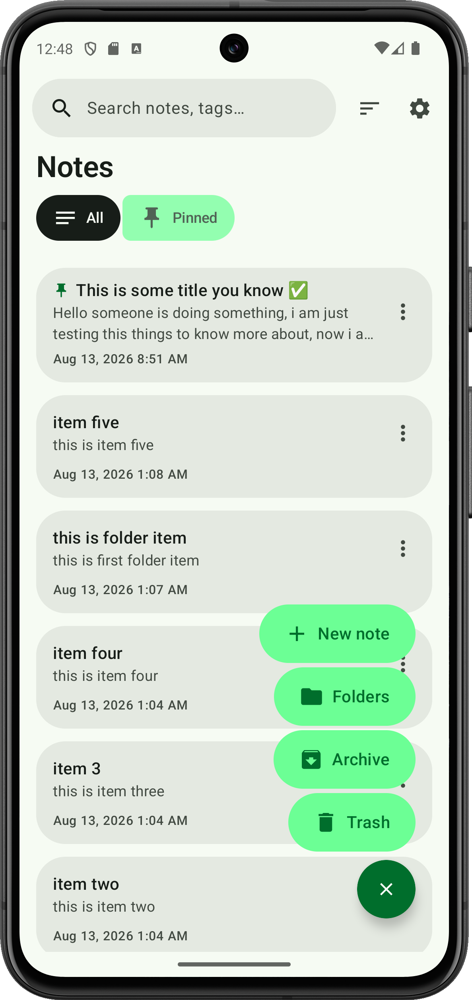
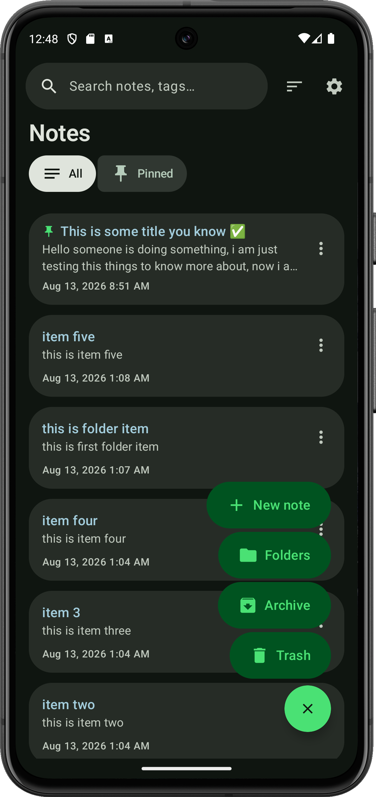
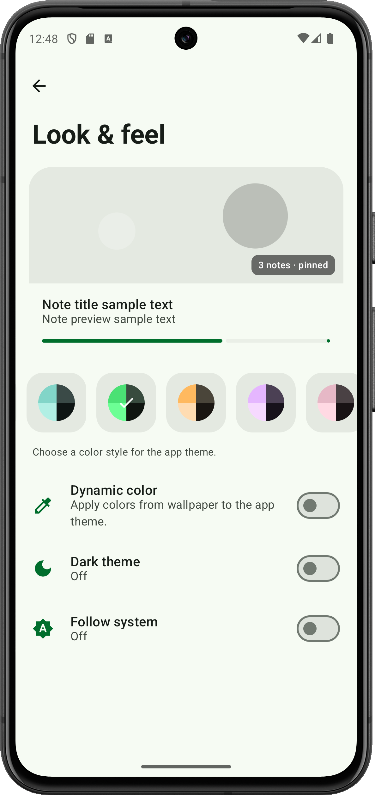
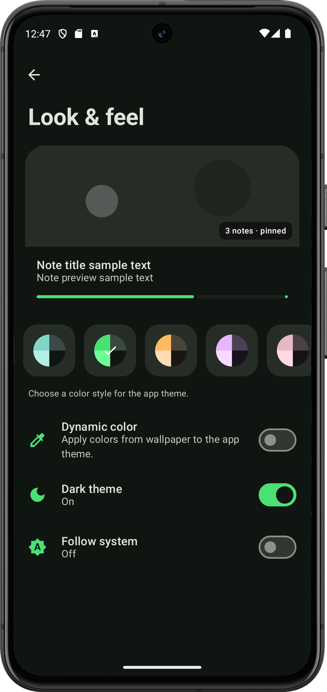

  

<h1 align="center">Notes</h1>

  A simple notes app for Android. 
  Write things down. Keep them on your phone.

  <a href="https://github.com/kumarPraveen08/simple-note-app/releases/latest">Download APK</a> ·
  <a href="docs/BUILD.md">Build guide</a> ·
  <a href="LICENSE">MIT License</a>

## About

Notes is a local notes app. No account, no cloud. You can write, pin, search, and sort notes, put them in folders, and attach files. Light and dark themes are built in.

## Screenshots

  
  
  
  

## Features

- Write notes with a title and body
- Pin important notes
- Search notes and tags
- Folders to keep things tidy
- Checklists, tags, and note colors
- Attach files to a note
- Archive and trash, with restore
- Version history if you want to go back
- Light, dark, or follow the phone
- Pick a color style, or use wallpaper colors
